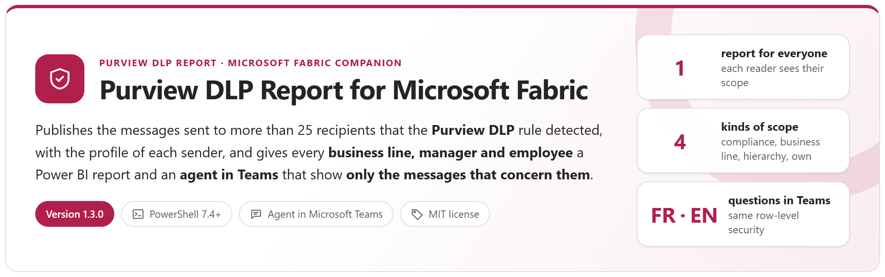
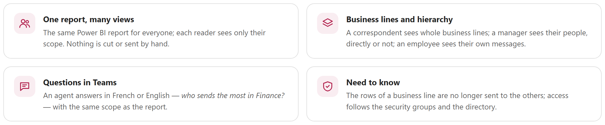
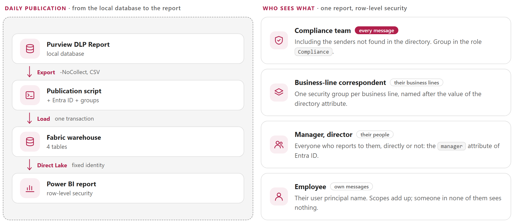
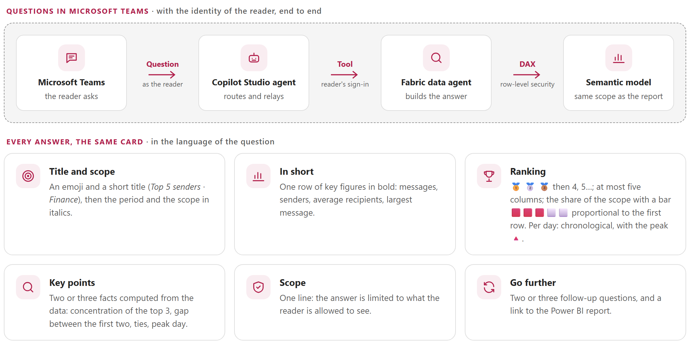
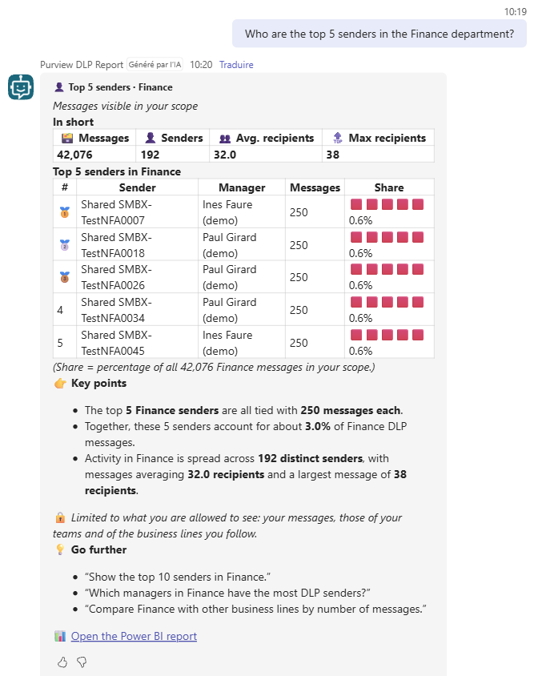
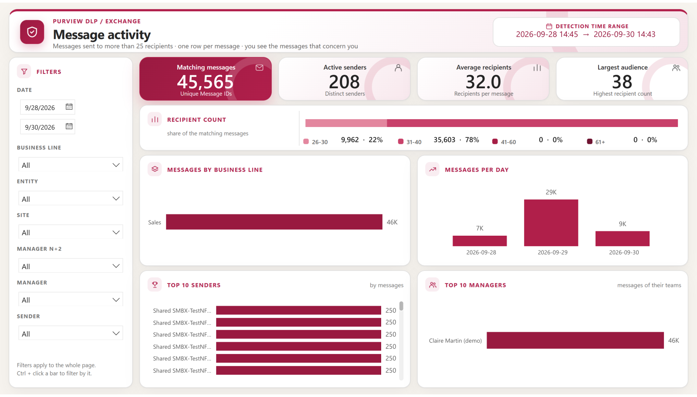
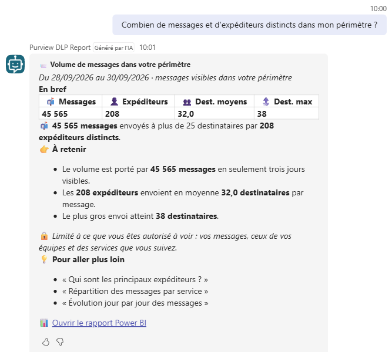
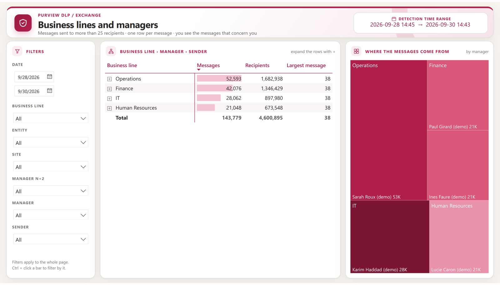
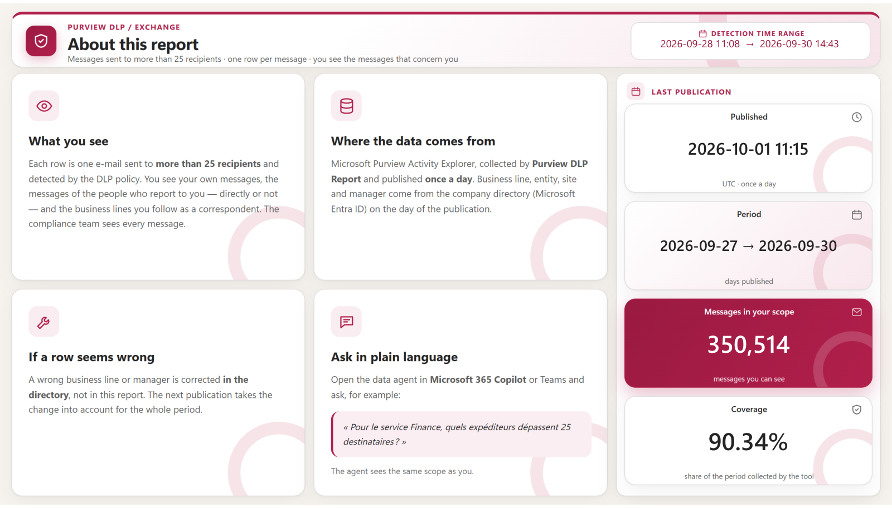

<p align="center">
  <picture>
    <source media="(prefers-color-scheme: dark)" srcset="package/docs/images/readme-banner-dark.png">
    
  </picture>
</p>

<p align="center">
  <a href="#how-it-works"><b>How it works</b></a> &nbsp;&middot;&nbsp;
  <a href="#questions-in-microsoft-teams"><b>Agent in Teams</b></a> &nbsp;&middot;&nbsp;
  <a href="#screenshots"><b>Screenshots</b></a> &nbsp;&middot;&nbsp;
  <a href="#requirements"><b>Requirements</b></a> &nbsp;&middot;&nbsp;
  <a href="#quick-start"><b>Quick start</b></a> &nbsp;&middot;&nbsp;
  <a href="package/docs/PurviewDlpReport-Fabric-UserGuide.md"><b>User guide</b></a> &nbsp;&middot;&nbsp;
  <a href="package/docs/PurviewDlpReport-Fabric-Guide.md"><b>Developer guide</b></a>
</p>

> [!IMPORTANT]
> Files downloaded from the Internet may be blocked by Windows and fail to run. Before using this project, unblock every file in the downloaded folder:
>
> ```powershell
> Get-ChildItem "C:\Chemin\Du\Dossier" -Recurse -File -Force | Unblock-File
> ```
>
> Replace the example path with the folder where you downloaded or extracted this project.
>
> The `Install-Module` commands in this documentation use `-Force`, so they also update or reinstall a module that is already installed. If an older version still conflicts, close every PowerShell window, open a new one (as administrator for `-Scope AllUsers`), run `Uninstall-Module <ModuleName> -AllVersions -Force`, then run the `Install-Module` command again.

## Why

[Purview DLP Report](https://github.com/Nico77600/PurviewDlpReport) produces one report with every message sent to more than 25 recipients — in a large organisation, tens of thousands a day. Sent as it is to every business line, each correspondent has to find their own people among all the others, and sees the messages of the other business lines. This optional companion publishes the same rows to Microsoft Fabric and lets each reader open **one report that shows only their scope**.

<picture>
  <source media="(prefers-color-scheme: dark)" srcset="package/docs/images/readme-why-dark.png">
  
</picture>

## How it works

<picture>
  <source media="(prefers-color-scheme: dark)" srcset="package/docs/images/readme-how-dark.png">
  
</picture>

- **Purview DLP Report is not changed.** The companion runs it with `-NoCollect` (local database only) and reads its CSV output — one row per Message ID.
- **The directory is the reference.** Business line, entity, site and the whole management chain come from Microsoft Entra ID at each publication; correspondents are members of one security group per business line.
- **One script, unattended.** `Publish-DlpReportToFabric.ps1` replaces the four tables of a Fabric warehouse in one transaction every day (certificate, scheduled task); `-Mode Deploy` writes the Direct Lake semantic model, its row-level security and the report as code.
- **Readers never touch the warehouse.** The model reads it with a fixed read-only identity; readers get the report and the agent only, filtered.

## Questions in Microsoft Teams

<picture>
  <source media="(prefers-color-scheme: dark)" srcset="package/docs/images/readme-agent-dark.png">
  
</picture>

A **Fabric data agent** on the semantic model, relayed in Teams by a **Copilot Studio** agent with **user authentication**: every answer is computed with the identity of the reader, so the row-level security of the report applies. Same question, two readers:

<table>
  <tr>
    <th width="50%">Compliance team</th>
    <th width="50%">Sales team lead</th>
  </tr>
  <tr>
    <td valign="top"><a href="package/docs/images/teams-compliance-finance.png?raw=true"></a></td>
    <td valign="top"><a href="package/docs/images/teams-team-lead-finance.png?raw=true"></a></td>
  </tr>
</table>

## Screenshots

The Power BI report has the visual identity of the HTML report of Purview DLP Report. Click a screenshot to open it at full size.

<table>
  <tr>
    <td width="50%" valign="top"><b>Overview</b> · compliance team, every message<br><a href="package/docs/images/report-overview.png?raw=true"></a></td>
    <td width="50%" valign="top"><b>Overview</b> · the same page for a team lead<br><a href="package/docs/images/report-overview-team-lead.png?raw=true"></a></td>
  </tr>
  <tr>
    <td width="50%" valign="top"><b>Agent in Teams</b> · a question in French<br><a href="package/docs/images/teams-team-lead-french.png?raw=true"></a></td>
    <td width="50%" valign="top"><b>Agent in Teams</b> · a question in English<br><a href="package/docs/images/teams-team-lead-departments.png?raw=true"></a></td>
  </tr>
</table>

<details>
<summary><b>Messages</b> · one row per message, as seen by the correspondent of two business lines</summary>
<br>
<a href="package/docs/images/report-messages.png?raw=true"></a>
</details>

<details>
<summary><b>Hierarchy</b> · business line › manager N+2 › manager › sender, as seen by a director</summary>
<br>
<a href="package/docs/images/report-hierarchy.png?raw=true"></a>
</details>

<details>
<summary><b>About</b> · what the reader sees, where the data comes from, the last publication</summary>
<br>
<a href="package/docs/images/report-about.png?raw=true"></a>
</details>

The screenshots come from a demonstration tenant: test mailboxes and fictitious personas.

## Requirements

| Item | Requirement |
|---|---|
| Source | [Purview DLP Report](https://github.com/Nico77600/PurviewDlpReport) 2.1 or later, with its daily collection, on the same server |
| PowerShell | 7.4 or later, module **Az.Accounts** |
| Fabric | A Fabric capacity (F SKU) for the workspace; a **paid F2 or larger** for the data agent. Under F64, readers need Power BI Pro (included in Microsoft 365 E5) |
| Identities | A publication application (certificate, Graph `User.Read.All` and `GroupMember.Read.All`, workspace Contributor) and a model reader application (workspace Viewer, secret in a Fabric cloud connection) |
| Directory | A user attribute with the business line (`department` by default) and the `manager` attribute filled in |
| Groups | Compliance, viewers, and one correspondent group per business line |
| Agent in Teams *(optional)* | Copilot Studio and a Microsoft 365 Copilot license for the maker; readers with Microsoft 365 Copilot use it at no extra cost |
| Network | HTTPS to Microsoft Entra ID, Graph, Fabric and Power BI; TCP 1433 to `*.datawarehouse.fabric.microsoft.com` |

## Quick start

```powershell
git clone https://github.com/Nico77600/PurviewDlpReport-Fabric.git
cd PurviewDlpReport-Fabric\package
notepad .\config\PurviewDlpReport-Fabric.config.psd1     # tenant, application, workspace, warehouse, connection, groups

.\Publish-DlpReportToFabric.ps1                          # first publication: creates and loads the four tables
.\Publish-DlpReportToFabric.ps1 -Mode Deploy             # semantic model, row-level security, report (and the data agent)
.\Publish-DlpReportToFabric.ps1 -Mode Status             # what is published
.\Publish-DlpReportToFabric.ps1 -Mode AgentInstructions  # texts to paste into the data agent and the Copilot Studio agent
```

Then, once in the Power BI service: the groups in the two roles and the report shared with them (guide, chapter 7); every day, a scheduled task after the collection of Purview DLP Report (chapter 8). The `package` folder of the repository holds exactly the files needed to run, with both guides; the zip of each [release](https://github.com/Nico77600/PurviewDlpReport-Fabric/releases) contains the same run-time files.

## Documentation

| Guide | Content |
|---|---|
| **[User guide](package/docs/PurviewDlpReport-Fabric-UserGuide.md)** | For the person who deploys the companion and runs it day to day: what to have ready, the one-time setup in order (capacity, tenant settings, workspace and warehouse, groups, the two applications, cloud connection, server, configuration, first publication and deployment, roles and sharing), the daily publication and how to check it, reading the report, the questions in Teams, keeping the audiences right, and the situations that come back. |
| **[Developer guide](package/docs/PurviewDlpReport-Fabric-Guide.md)** | Everything else: how it works and the four tables, every prerequisite and how to set it up, every configuration key, the deployment, the report, the Fabric data agent and the Copilot Studio agent in Teams, the tests with their reference results, the internals, the security model, troubleshooting, the design choices, the options without Fabric and licensing. |

Both guides also exist as a single HTML file with a light and a dark theme (`package/docs/PurviewDlpReport-Fabric-UserGuide.html`, `package/docs/PurviewDlpReport-Fabric-Guide.html`): download them and open them locally, or use the copies in the release zip.

## Tests

```powershell
Invoke-Pester -Path .\tests      # Pester 5+, no connection to Microsoft 365 or Fabric
```

The companion was also validated end to end on a demonstration tenant (350,514 messages, 1,600 senders, fictitious personas): row-level security of the report for every kind of reader, and the same figures through the agent in Teams, in French and in English (guide, chapter 13).

## License

[MIT](LICENSE).

## Disclaimer

This Script is a Personal project.
It's provided "AS-IS". It's not an official Microsoft product so no support can be expected from Microsoft.

As any scripts you must read carefully the documentation and test it first in a Test environment before any run in Production.
