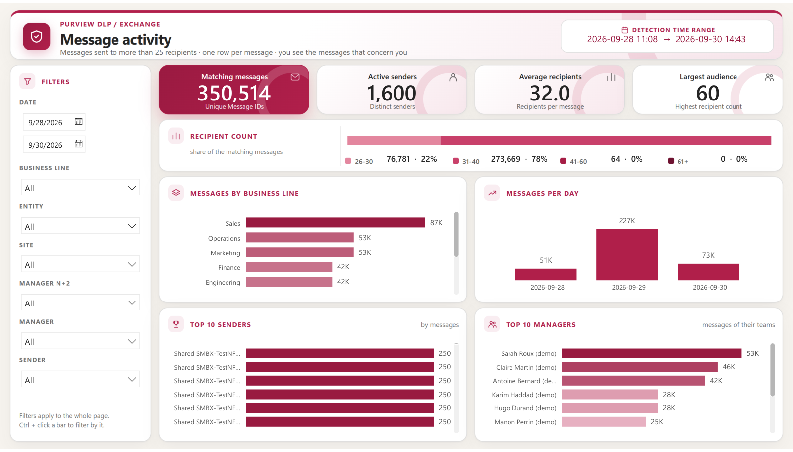
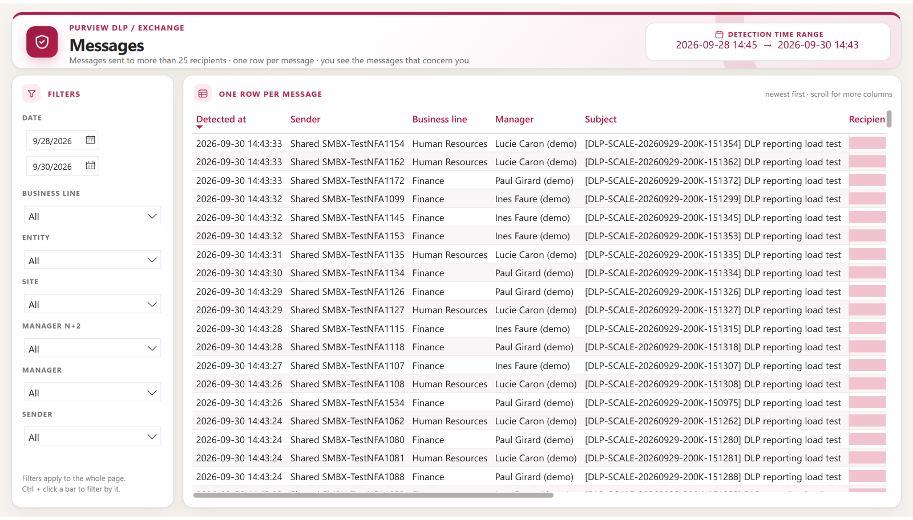
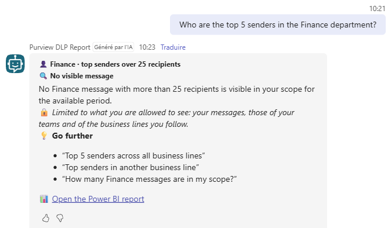
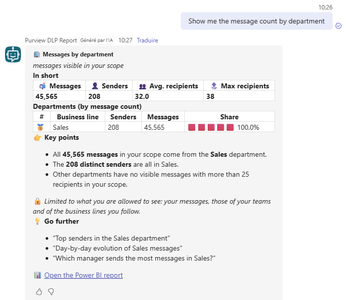

# Purview DLP Report for Microsoft Fabric — Administrator guide

> An **optional companion** of Purview DLP Report. It publishes the same rows — **one row per Message ID** — to Microsoft Fabric with the profile of each sender, and gives every business line, manager and employee a Power BI report and an agent in Microsoft Teams that show **only the messages that concern them**.

```cards
target | What it answers | Which of *my* people or *my* business lines send messages to more than 25 recipients — without reading the rows of the others.
download | Where the data comes from | The local database of **Purview DLP Report** (read only, `-NoCollect`) and the directory (**Microsoft Entra ID**).
database | Where it goes | A **Fabric warehouse**: four tables, replaced in one transaction at each publication.
chart | What people open | A **Power BI report** with **row-level security** and, optionally, an **agent in Microsoft Teams** that answers in plain language. Each reader sees their own scope.
```

## Quick start

```steps
Check the prerequisites | A Fabric capacity, a few tenant settings, two applications, security groups — chapter 4.
Set them up | Capacity, workspace, warehouse, groups, applications and cloud connection, step by step — chapter 5.
Configure | `config\PurviewDlpReport-Fabric.config.psd1` — chapter 6.
Publish, then deploy | `.\Publish-DlpReportToFabric.ps1` loads the warehouse; `-Mode Deploy` creates the semantic model, the row-level security and the report — chapter 7.
Open it to the readers | Once in the Power BI service: groups in the two roles, report shared — chapter 7.
Schedule the publication | Every day, after the collection of Purview DLP Report — chapter 8.
Add the agent *(optional)* | The Fabric data agent (chapter 11), then the Copilot Studio agent in Microsoft Teams (chapter 12).
Validate | Offline tests, then the checks of chapter 13 with a few real readers.
```

> [!IMPORTANT]
> **Purview DLP Report is not changed and does not depend on this companion.** The companion only reads its local database. Fabric is one way to deliver the report per business line, **not a requirement**: Annex C lists the options without Fabric.

# Part I · Understand

<!-- icon: book -->
## 1. Goal

**The situation**

- Purview DLP Report produces **one report with every message** of the period — in a large organisation, tens of thousands of messages a day.
- The same report is **sent to every business line**. Each correspondent has to search the rows of their own people among those of all the others.
- The report contains every sender and every subject: **each business line sees the messages of the other business lines**.

**What the companion brings**

```cards
people | One report, many views | The same Power BI report for everyone; each reader sees only their scope. Nothing is cut or sent by hand.
layers | Business lines and hierarchy | A correspondent sees whole business lines; a manager sees their people, directly or not; an employee sees their own messages.
chat | Questions in Teams | An agent answers in French or English — *who sends the most in Finance?* — with the same scope as the report.
shield | Need to know | The rows of a business line are no longer sent to the others; access follows the security groups and the directory.
```

**What it is not**

- Not a replacement for Purview DLP Report: the collection, the database, the CSV and HTML files stay as they are.
- Not a change of the DLP policy or of Exchange Online: the companion is **read-only** for Microsoft 365.
- Not imposed: the directory data and the per-business-line logic can also be used without Fabric (Annex C).

<!-- icon: flow -->
## 2. How it works

```flow
database | Purview DLP Report | local database
arrow | Export | -NoCollect, CSV
terminal | Publication script | + Entra ID + groups
arrow | Load | one transaction
database | Fabric warehouse | 4 tables
arrow | Direct Lake | fixed identity
chart | Power BI report | row-level security
```

| Stage | What happens |
|---|---|
| **1 · Export** | The script runs `Invoke-PurviewDlpReport.ps1 -Mode Report -Range Custom -NoCollect` on the last `HistoryDays` days (90 by default). Purview DLP Report reads only its database and writes a CSV file — one row per Message ID, recipient count only. |
| **2 · Directory** | Microsoft Graph: every user with addresses, business-line attribute, entity, site, job title and manager. Each sender address is matched to a user; the management chain is computed up to 15 levels. |
| **3 · Audiences** | The members of the business-line correspondent groups become the table `report_access`. |
| **4 · Load** | The four tables of the warehouse are **replaced in one transaction**: readers see the previous publication until the new one is complete. |
| **5 · Refresh** | The Direct Lake semantic model is refreshed (a few seconds: no data is copied). |

**The four tables**

| Table (warehouse) | In the report | Content |
|---|---|---|
| `dlp_messages` | Messages | One row per Message ID: detection time (report time zone), date, sender address, sender ID, subject, recipient count |
| `directory_users` | Senders | One row per sender found in the directory: name, business line, department, entity, site, job title, manager, manager N+2, management chain |
| `report_access` | Report access (hidden) | Correspondent → business line, from the security groups |
| `publish_info` | Publication | Date, period, coverage of the source database, counts |

**Who sees what — row-level security**

| Reader | Sees | Driven by |
|---|---|---|
| Compliance team | **Every message**, including the senders not found in the directory | Group in the role `Compliance` |
| Business-line correspondent | Every message of **their business lines** | Group `… Business line - <name>` |
| Manager, director | The messages of **the people who report to them, directly or not** | `manager` attribute in Entra ID |
| Employee | **Their own messages** | User principal name |

A reader can combine several of these scopes: they add up. Someone in none of them sees nothing.

**Questions in plain language** — the agent never reads the warehouse: it queries the **same semantic model with the identity of the reader**, so the row-level security applies to every answer.

```flow
chat | Microsoft Teams | the reader asks
arrow | Question | as the reader
bot | Copilot Studio agent | routes and relays
arrow | Tool | reader's sign-in
search | Fabric data agent | builds the answer
arrow | DAX | row-level security
chart | Semantic model | same scope as the report
```

<!-- icon: lightbulb -->
## 3. Things to know

> [!WARNING]
> **The directory is the reference.** Business line, entity, site and manager are read on the day of the publication. A missing manager or business line in Entra ID means a message that only the compliance team (and the managers above, if any) see. Check the quality of the attributes before opening the report (chapter 10).

> [!NOTE]
> **A daily snapshot.** The report shows the database of Purview DLP Report as it was at the publication. Rows of the last hours are provisional, as in Purview DLP Report itself (late events). The page *About* shows the period and its coverage.

> [!NOTE]
> **The history follows the directory of today.** If someone changes business line, all their messages of the period move with them at the next publication. The report answers *“who in my scope today sends to many recipients”*, not *“which business line was it in at the time”*.

> [!TIP]
> **A few one-time steps stay manual**, because Microsoft offers no API for them: the groups of the two roles and the sharing of the report (Power BI service), the first publication of the data agent (Fabric) and the Copilot Studio agent. They are done once (chapters 7, 11 and 12).

> [!NOTE]
> **Answers of the agent are generated by a language model.** The figures come from the semantic model, but the wording can vary from one question to the next. The report remains the reference.

# Part II · Set up

<!-- icon: checklist -->
## 4. Prerequisites

| Item | Requirement | Needed for |
|---|---|---|
| **Fabric capacity** | An F SKU for the workspace (warehouse and Direct Lake). The data agent needs a **paid** capacity, **F2 or larger** (not a trial). Size it with the agent in mind (chapter 5.1) | Everything |
| **Readers** | Capacity **F64 or larger**: no Power BI license. **Smaller than F64**: **Power BI Pro** for every reader (included in Microsoft 365 E5) | Report and agent |
| **Microsoft 365 Copilot** | A license for the person who builds the Copilot Studio agent. Readers with a license use the agent in Teams at no extra cost; for the others, the agent consumes Copilot credits (Annex D) | Teams agent |
| **Copilot Studio** | Access to Copilot Studio and a Power Platform environment with Dataverse (the default environment is enough) | Teams agent |
| **Tenant settings** | Fabric items, service principals, Copilot and Azure OpenAI (chapter 5.2) | Everything |
| **Directory** | A user attribute that holds the business line (`department` by default) and the `manager` attribute filled in | Everything |
| **Server** | The server of Purview DLP Report: PowerShell **7.4 or later**, module **Az.Accounts**, Purview DLP Report **2.1 or later** with its daily collection | Publication |
| **Network** | HTTPS to `login.microsoftonline.com`, `graph.microsoft.com`, `api.fabric.microsoft.com`, `api.powerbi.com`; **TCP 1433** to `*.datawarehouse.fabric.microsoft.com` | Publication |

**Identities**

```cards
key | Publication application | Certificate, Microsoft Graph **User.Read.All** and **GroupMember.Read.All** (application, admin consent), workspace role **Contributor**, role **User** on the cloud connection. Runs the publication and the deployment unattended.
shield | Model reader application | Read-only **fixed identity** of the semantic model: workspace role **Viewer**, no Graph permission. Its secret is stored **only in the Fabric cloud connection**.
people | Security groups | **Compliance**, **Viewers** (everyone allowed to open the report) and one **correspondent group per business line**; plus one group with the two applications, for the tenant setting.
user | Administrators | Workspace **Admin** for the people who deploy; the **first publication of the data agent** and the **Copilot Studio agent** are done by a person (chapters 11 and 12).
```

> [!NOTE]
> Two applications, because a Fabric cloud connection accepts a **client secret** only, while the publication runs unattended with a **certificate**. The reader application can read the warehouse and nothing else.

<!-- icon: wrench -->
## 5. Setting up the prerequisites

The names below are examples: keep them or use your own conventions.

### 5.1 Fabric capacity

Create the capacity in the **Azure portal** (*Create a resource > Microsoft Fabric*: subscription, resource group, name in lowercase letters and digits, **region**, size, capacity administrator), or with Az PowerShell:

```powershell
Connect-AzAccount -Tenant '<tenant ID>' -Subscription '<subscription ID>'
Register-AzResourceProvider -ProviderNamespace Microsoft.Fabric          # once per subscription
New-AzResourceGroup -Name 'rg-purviewdlpreport' -Location 'francecentral'

$capacity = "/subscriptions/$((Get-AzContext).Subscription.Id)/resourceGroups/rg-purviewdlpreport/providers/Microsoft.Fabric/capacities/purviewdlpreport"
$body = @{ location = 'francecentral'; sku = @{ name = 'F8'; tier = 'Fabric' }
           properties = @{ administration = @{ members = @('admin@contoso.com') } } } | ConvertTo-Json -Depth 5
Invoke-AzRestMethod -Method PUT -Path "$capacity`?api-version=2023-11-01" -Payload $body

# Pause when it is not used (nothing is billed for compute, the report and the agent are unavailable), resume before use
Invoke-AzRestMethod -Method POST -Path "$capacity/suspend?api-version=2023-11-01"
Invoke-AzRestMethod -Method POST -Path "$capacity/resume?api-version=2023-11-01"
```

| Choice | Guidance |
|---|---|
| **Region** | Data stays in the region of the capacity: choose it **in the EU** (for example France Central) if the data must stay there. Copilot and the data agent are available in the EU Data Boundary without cross-geo settings |
| **Size** | **F2** is enough for the report. The data agent runs several queries per question: on the demonstration data set (350,000 messages), an F2 was **throttled** when a few people asked questions in a row, an **F8** was comfortable. Measure with the **Fabric Capacity Metrics** app during a pilot and scale up or down at any time (`sku` of the capacity) |
| **Readers** | Under **F64**, every reader needs Power BI Pro (included in Microsoft 365 E5) |

### 5.2 Tenant settings

**Fabric admin portal > Tenant settings** (changes can take up to one hour):

| Setting | Value | Why |
|---|---|---|
| *Users can create Fabric items* | Enabled, at least for the administrators of the workspace | Warehouse |
| *Service principals can call Fabric public APIs* (Developer settings) | Enabled for the **group of the two applications** | Publication and deployment |
| *Users can use Copilot and other features powered by Azure OpenAI* | Enabled (tenant or capacity) | Data agent, Copilot in Power BI |
| *Data sent to Azure OpenAI can be processed / stored outside your capacity's geographic region* | **Only if** the capacity is outside the EU Data Boundary and the US | Data agent |

### 5.3 Workspace and warehouse

```steps
Workspace | Fabric > **Workspaces > New workspace**, for example `Purview DLP Report`; *Advanced > License mode*: **Fabric capacity**, the capacity of 5.1.
Warehouse | In the workspace: **New item > Warehouse**, for example `PurviewDlpReport`.
IDs | Open the warehouse: the URL is `…/groups/<workspace ID>/warehouses/<warehouse ID>…`. Note both GUIDs for the configuration.
Access | **Manage access**: the administrators as **Admin** — and nobody else for now (5.5 and 5.6 add the two applications).
```

### 5.4 Security groups

The name after the prefix must be **the exact value of the business-line attribute** (for example `Sales` for `department = Sales`).

```powershell
Connect-MgGraph -Scopes 'Group.ReadWrite.All'
$names = 'DLP Report - Compliance', 'DLP Report - Viewers', 'DLP Report - Fabric applications',
         'DLP Report - Business line - Sales', 'DLP Report - Business line - Finance'      # one per business line
foreach ($name in $names) {
    New-MgGroup -DisplayName $name -SecurityEnabled -MailEnabled:$false -MailNickname ($name -replace '[^A-Za-z0-9]', '')
}
```

| Group | Members |
|---|---|
| `DLP Report - Compliance` | The compliance team: sees every message |
| `DLP Report - Viewers` | Everyone allowed to open the report — for example a **dynamic group** of all employees |
| `DLP Report - Business line - <name>` | The correspondents of that business line (also in the viewers group) |
| `DLP Report - Fabric applications` | The two applications (tenant setting of 5.2) |

### 5.5 Publication application

```powershell
# Certificate in the store of the account that runs the scheduled task (private key not exportable)
$cert = New-SelfSignedCertificate -Subject 'CN=PurviewDlpReport-Fabric' -CertStoreLocation Cert:\CurrentUser\My `
    -KeyExportPolicy NonExportable -KeySpec Signature -KeyLength 2048 -HashAlgorithm SHA256 -NotAfter (Get-Date).AddYears(2)
Export-Certificate -Cert $cert -FilePath .\PurviewDlpReport-Fabric.cer   # public key only, to upload to the application
$cert.Thumbprint                                                          # for the configuration
```

```steps
Register | Microsoft Entra ID > **App registrations > New registration**, for example `Purview DLP Report - Fabric publication`, single tenant. Note the **application (client) ID** and the **tenant ID**.
Certificate | **Certificates & secrets > Certificates > Upload**: `PurviewDlpReport-Fabric.cer`.
Graph | **API permissions > Add > Microsoft Graph > Application permissions**: `User.Read.All` and `GroupMember.Read.All`, then **Grant admin consent**.
Group | Add the application (its enterprise application) to `DLP Report - Fabric applications`.
Workspace | Fabric > workspace > **Manage access**: the application as **Contributor**.
```

> [!IMPORTANT]
> Create the certificate **with the account that runs the scheduled task** (or import it into its `Cert:\CurrentUser\My`, or into `Cert:\LocalMachine\My` with read access to the private key): the script looks for it there.

### 5.6 Model reader application and cloud connection

The semantic model reads the warehouse with this **fixed identity**, so that readers never need access to the warehouse.

```steps
Register | **App registrations > New registration**, for example `Purview DLP Report - model reader`; **Certificates & secrets > New client secret** (note the value: it is shown once). No API permission.
Group and workspace | Add it to `DLP Report - Fabric applications`; workspace **Manage access**: **Viewer**.
SQL endpoint | Warehouse > **Settings > SQL endpoint**: copy the **SQL connection string** (`….datawarehouse.fabric.microsoft.com`).
Cloud connection | Fabric > **Settings > Manage connections and gateways > New > Cloud**: type **SQL Server**, server = the SQL connection string, database = the **warehouse ID**, authentication **Service principal** (tenant ID, client ID, secret of the model reader), **single sign-on off**, privacy level *Organizational*.
Users of the connection | On the connection: **Manage users** > the publication application as **User**. Note the **connection ID** (connection settings).
```

> [!CAUTION]
> **Do not give the readers a workspace role.** Even *Viewer* lets them query the warehouse directly, without row-level security. Readers get access **only** through the report (sharing or app) and the data agent (sharing). The workspace is for the administrators and the two applications.

### 5.7 Server

```powershell
Install-Module Az.Accounts -Scope AllUsers            # sign-in and tokens
git clone https://github.com/Nico77600/PurviewDlpReport-Fabric.git D:\Tools\PurviewDlpReport-Fabric
# or: the zip of the latest release, unblocked (Unblock-File) and extracted to the same folder
```

The companion runs next to Purview DLP Report, with the account of its scheduled task. Check that Purview DLP Report collects every day (`.\Invoke-PurviewDlpReport.ps1 -Mode Status`): the companion publishes what its database holds.

<!-- icon: settings -->
## 6. Configuration

Everything is in **`config\PurviewDlpReport-Fabric.config.psd1`** (PowerShell data file). Relative paths are relative to the script folder.

| Setting | Default | Meaning |
|---|---|---|
| `Source.ToolPath` | `C:\Scripts\PurviewDlpReport` | Folder of `Invoke-PurviewDlpReport.ps1` |
| `Source.ConfigPath` | *(empty)* | Configuration of Purview DLP Report; empty = its default file |
| `Source.HistoryDays` | `90` | Days published (complete days, yesterday included). At most the retention of the database |
| `Authentication.Mode` | `Certificate` | `Certificate` (unattended) or `Interactive` (browser, for tests) |
| `Authentication.TenantId` / `ApplicationId` / `CertificateThumbprint` | — | Publication application (5.5) |
| `Fabric.WorkspaceId` / `WarehouseId` | — | Workspace and warehouse (5.3) |
| `Fabric.SemanticModelName` / `ReportName` | `Purview DLP Report` | Names of the items created by `-Mode Deploy` |
| `Fabric.DataAgentName` | *(empty)* | Name of the Fabric data agent created by `-Mode Deploy` (chapter 11), for example `Purview DLP Report agent`; empty = no agent |
| `Fabric.ConnectionId` | *(empty)* | Cloud connection with the fixed identity (5.6). **Empty = single sign-on**: readers would need access to the warehouse |
| `Directory.BusinessLineAttribute` | `department` | `department`, `companyName`, `officeLocation`, `jobTitle`, `employeeOrgData.division`, `employeeOrgData.costCenter` or `onPremisesExtensionAttributes.extensionAttribute1` … `15` |
| `Directory.MaxManagerLevels` | `15` | Depth of the management chain |
| `Access.ComplianceGroups` / `ViewerGroups` | — | Group names or IDs; `-Mode Deploy` checks them and recalls which group goes in which role |
| `Access.BusinessLineGroupPrefix` | — | Every group whose name starts with the prefix is a correspondent group; the rest of the name is the business line (`DLP Report - Business line - `) |
| `Access.BusinessLineGroups` | `@{}` | Alternative to the prefix: `@{ 'Sales' = '<group ID or name>' }` |
| `Local.WorkPath` / `LogPath` / `LogRetentionDays` | `.\work` / `.\logs` / `30` | Temporary files (deleted after success), daily log |

> [!TIP]
> A business line spread over several attribute values (for example two department names) is covered by giving the same correspondents both groups, or by listing both values in `Access.BusinessLineGroups`.

<!-- icon: play -->
## 7. Deployment

`Publish-DlpReportToFabric.ps1` is **the only script to run**:

| Mode | What it does | When |
|---|---|---|
| `Publish` *(default)* | Exports the period from Purview DLP Report, reads the directory and the groups, replaces the four tables in one transaction, refreshes the semantic model | Every day (chapter 8) |
| `Deploy` | Creates or updates the semantic model (Direct Lake, roles, preparation for AI), binds it to the cloud connection, creates or replaces the report; creates the data agent once, as a draft | First installation, after an update of the companion |
| `Status` | Shows the warehouse, the row counts, the semantic model and the last publication. Changes nothing | Any time |
| `AgentInstructions` | Writes the texts of the data agent and of the Copilot Studio agent to the work folder | Chapters 11 and 12 |

```steps
First publication | `.\Publish-DlpReportToFabric.ps1` — creates the four tables and loads them (the semantic model does not exist yet: the script says so).
Deployment | `.\Publish-DlpReportToFabric.ps1 -Mode Deploy` — semantic model, binding to the cloud connection, report, and the data agent if `Fabric.DataAgentName` is set.
Roles (once) | Power BI service > workspace > semantic model > **… > Security**: role `Compliance` ← `DLP Report - Compliance`, role `Scoped` ← `DLP Report - Viewers`. The members are kept by later deployments.
Sharing (once) | Report > **Share**: both groups, read only (**no** *Allow recipients to share* or *Build*) — or publish a **workspace app** for them. This gives them Read on the semantic model.
Check | `.\Publish-DlpReportToFabric.ps1 -Mode Status`, then open the report with an account of the compliance team (chapter 13).
```

> [!WARNING]
> `-Mode Deploy` **replaces the report**. To customise it in the Power BI service, save a copy under another name (*File > Save a copy*) and share the copy, or change `src\ReportDefinition.ps1`. The members of the two roles are kept.

<!-- icon: clock -->
## 8. Daily publication

```powershell
# Every day, after the collection of Purview DLP Report (for example 06:30 if the collection runs at 06:00)
$action  = New-ScheduledTaskAction -Execute 'pwsh.exe' -WorkingDirectory 'D:\Tools\PurviewDlpReport-Fabric' `
           -Argument '-NoProfile -NonInteractive -File .\Publish-DlpReportToFabric.ps1'
$trigger = New-ScheduledTaskTrigger -Daily -At 06:30
Register-ScheduledTask -TaskName 'Purview DLP Report - Fabric publication' -Action $action -Trigger $trigger `
           -User 'CONTOSO\svc-dlpreport' -Password (Read-Host 'Password of the service account') -RunLevel Limited
```

**Duration** — measured on the demonstration data set (350,514 messages, 1,600 senders, 11,679 directory users):

| Step | Duration |
|---|---|
| Export from Purview DLP Report (`-NoCollect`) | 7 to 16 s |
| Directory (Microsoft Graph) | 38 to 42 s |
| Preparing the tables | 4 s |
| Warehouse, 4 tables in one transaction | 34 to 45 s |
| Refresh of the semantic model | 9 s |
| **Total** | **1 min 30 s to 2 min 06 s** |

> [!NOTE]
> At 30,000 to 50,000 messages a day (90 days ≈ 2.7 to 4.5 million rows) and a directory of about 100,000 users, expect **15 to 20 minutes**, mostly the bulk load and the directory. Reduce `HistoryDays` if needed.

### Exit codes and status

| Code | Meaning |
|---|---|
| `0` | Published; the source period is complete |
| `2` | Published, but the database of Purview DLP Report does **not cover the whole period** (shown in the log and on the page *About*) |
| `1` | Failure — nothing changed in the warehouse (the transaction is rolled back) |

```powershell
.\Publish-DlpReportToFabric.ps1 -Mode Status     # warehouse, row counts, semantic model, last publication
```

# Part III · Use

<!-- icon: chart -->
## 9. The report

Four pages with the **visual identity of the HTML report** of Purview DLP Report and of this guide: warm background, white cards, crimson accent, gradient tile for the main figure. The same filters are on the left of each page: date, business line, entity, site, manager N+2, manager, sender.

**Overview** — four tiles (matching messages, active senders, average recipients, largest audience), the **recipient count** strip (26–30, 31–40, 41–60, 61+ recipients: count and share), messages by business line and per day, top 10 senders and top 10 managers. As seen by the compliance team (every message):



**The same page for a team lead** — only the 208 people of her team: every figure, bar and share follows her scope.


**Messages** — one row per message, newest first, as seen by the correspondent of two business lines:



**Hierarchy** — business line › manager N+2 › manager › sender, as seen by a director:


**About** — what the reader sees, where the data comes from, the last publication and its coverage.


> [!TIP]
> Readers can export a visual to Excel or CSV: the export contains only their rows. Sending a report by e-mail is no longer needed: each reader can **subscribe** to the report and receive their own view by e-mail.

**How the design is built** — the cards, titles, icons and tiles are **page backgrounds** drawn as HTML/CSS with the palette of the HTML report, and the Power BI visuals are transparent and placed exactly in the cards; a custom theme gives the crimson palette to the charts.

| Element | File |
|---|---|
| Page backgrounds (PNG, 2560 × 1440) and the position of each visual | `src\report\bg-*.png`, `src\report\layout.json` |
| Theme of the report (colours, fonts, tables) | `src\report\PurviewDlpReport.theme.json` |
| Generator of the backgrounds and of the layout | `tools\new_report_backgrounds.py` (Python 3 + Playwright, uses Microsoft Edge) |

To change a title, a colour or the place of a card: change `tools\new_report_backgrounds.py`, run it (`python tools\new_report_backgrounds.py`), then `-Mode Deploy`. The generated files are delivered with the companion: Python is needed only to change the design.

<!-- icon: people -->
## 10. Managing the audiences

| Need | What to do | Effective |
|---|---|---|
| New correspondent for a business line | Add the person to `DLP Report - Business line - <name>` and to the viewers group | Next publication |
| New business line | Create the group with the exact attribute value after the prefix | Next publication |
| A manager changes, a person moves | Change the directory (`manager`, business-line attribute) — **not** the report | Next publication |
| Compliance team | Membership of the compliance group | Immediately |
| Everyone may open the report | Viewers group, for example a dynamic group of all employees | Immediately |

**Check the directory before opening the report**

```sql
-- Senders without business line or without manager in the last publication (warehouse, any SQL tool)
SELECT DisplayName, Mail, BusinessLine, ManagerName FROM dbo.directory_users
WHERE BusinessLine IS NULL OR ManagerName IS NULL;
```

The log of each publication also gives the counts: senders found, with a business line, with a manager, and senders **not found** in the directory (external or deleted mailboxes) — their messages are visible to the compliance team only.

<!-- icon: search -->
## 11. Questions in plain language — the Fabric data agent

Readers can **ask questions in French or English** instead of filtering the report — *Pour le service Finance, quels expéditeurs dépassent 25 destinataires ?*, *Show me the message count by department*. The **Fabric data agent** answers from the **same semantic model, with the same row-level security**: a Finance correspondent gets the Finance senders; a Sales team lead asking the same question gets *no message visible in your scope*; the compliance team gets everything.

```cards
search | Fabric data agent | Created by `-Mode Deploy` when `Fabric.DataAgentName` is set. Builds the queries and the answer. Can be used in Fabric, or from Copilot Studio and any MCP client.
chat | Agent in Microsoft Teams | A **Copilot Studio** agent that relays the data agent as a Teams app — **the recommended way** for the readers (chapter 12).
chart | Copilot in Power BI | The Copilot pane of the report uses the same preparation of the model.
```

**Set up the data agent** (once, in Fabric — there is no API for the publication):

```steps
Create | `-Mode Deploy` creates the agent **once, as a draft**, with its instructions and the link to the report. It never changes it afterwards.
Write the texts | `.\Publish-DlpReportToFabric.ps1 -Mode AgentInstructions` writes `agent-instructions.txt` and `agent-publish-description.txt` (and the texts of chapter 12) in the work folder.
Test | Fabric > workspace > the data agent: ask *Quels managers ont le plus de collaborateurs qui envoient des messages à plus de 25 destinataires ?* and *Show me the message count by department.* The workspace must be on a paid capacity.
Publish | **Publish** (top bar) > **description** = content of `agent-publish-description.txt` (never leave it empty: Copilot Studio and Microsoft 365 Copilot use it to call the agent) > **Publish**. Microsoft 365 registers **the first person who publishes** as the owner of the agent.
Share | On the agent: **Share** > `DLP Report - Viewers` and `DLP Report - Compliance`, **no additional permission** (they can query the published version only, not see or edit its configuration).
```

> [!IMPORTANT]
> **The data agent respects the row-level security**: it queries the semantic model with the identity of the person who asks. Readers need **Read on the semantic model** (given by the sharing of the report) and access to the agent (sharing). As for the report, **do not give them a workspace role**.

**The answer format** — the agent does not return a bare table: every answer is a small card, built from the data of the scope only, in the language of the question.

```cards
target | Title and scope | An emoji and a short title (*Top 5 senders · Finance*), then the period and the scope in italics.
chart | In short | One row of key figures in bold: messages, senders, average recipients, largest message.
trophy | Ranking | 🥇 🥈 🥉 then 4, 5…; at most five columns; the share of the scope with a bar 🟥🟥🟥⬜⬜ proportional to the first row. Per day: chronological, with the peak 🔺.
search | Key points | Two or three facts computed from the data: concentration of the top 3, gap between the first two, ties, peak day.
shield | Scope | One line: the answer is limited to what the reader is allowed to see.
refresh | Go further | Two or three follow-up questions, and a link to the Power BI report.
```

The format is written in the **agent instructions** (`New-DataAgentInstructions` in `src\AiDefinition.ps1`): French formats in French (42 076 · 32,0 · 12,5 %), English labels and formats in English (42,076 · 32.0 · 12.5% — *In short*, *Key points*, *Go further*), no technical words, display names rather than addresses, and an explicit *no message visible in your scope* when the result is empty. Data values (names, business lines) are never translated.

**How the model is prepared for AI** — written by `-Mode Deploy`, nothing to do by hand:

| Element | Content |
|---|---|
| Descriptions | Every table, column and measure (TMDL) |
| AI data schema and synonyms | `Copilot\schema.json`: *service, métier, direction* → Business line; *expéditeur* → Name; *N+1, responsable* → Manager … Hidden fields (security, keys) are excluded |
| AI instructions | `Copilot\Instructions\instructions.md`: every message is already above 25 recipients (never filter again), list of the business lines, default answer for *“which senders”*, wording when the scope is empty |
| Example prompts | Five questions shown to the readers |
| Data agent | Semantic model as the only source, tables *Messages*, *Senders*, *Publication*; agent instructions = answer format |

> [!NOTE]
> For a semantic model, the agent builds its queries from the **instructions of the model**, not from the instructions of the agent; this is why the companion writes them in the model. The agent instructions only shape the answer.

**Change the texts of an existing agent** — `-Mode Deploy` never changes an existing agent, to keep its publication: run `-Mode AgentInstructions`, paste `agent-instructions.txt` into **Agent instructions**, test, then **Publish** again with `agent-publish-description.txt`. The sharing is kept. To change the data source or the tables: delete the agent, run `-Mode Deploy`, publish and share again.

> [!NOTE]
> **Publishing the data agent directly to Microsoft 365 Copilot** (option *Publish to Microsoft 365 Copilot*, Agent Store) also works, without Copilot Studio. Two limits: the Copilot orchestrator can still **reshape the answer** (the publication description asks it not to), and the agent is reached through the **Copilot** app (*Agents*, or `@` in a Copilot chat), not as a Teams app of its own. Chapter 12 avoids both.

> [!WARNING]
> **Region.** The data agent sends the question and the results to Azure OpenAI; Copilot Studio and Microsoft 365 Copilot process the answers under their own terms, possibly outside the region of the capacity. Have the data protection officer validate the agent before opening it to the readers.

<!-- icon: chat -->
## 12. The agent in Microsoft Teams — Copilot Studio

A Copilot Studio agent with the data agent as its only tool gives the readers a **Teams app** that answers in **French or English** and shows the answer of the data agent **as it is**. The agent of Copilot Studio does not compute anything: it routes the question to the data agent **with the identity of the reader** and relays the answer.

| Compliance team | Sales team lead |
|---|---|
|  |  |

*Same question, same agent, two readers: the compliance team gets the Finance senders; the Sales team lead sees nothing of Finance.*

**Before you start**

- The data agent is **published** and **shared** with the readers (chapter 11).
- The maker has a **Microsoft 365 Copilot** license and access to Copilot Studio, and is signed in to **Fabric and Copilot Studio with the same account**, in the same tenant. Open the data agent once in Fabric with that account.

```steps
Write the texts | `.\Publish-DlpReportToFabric.ps1 -Mode AgentInstructions` writes `copilot-studio-instructions.txt`, `copilot-studio-tool-description.txt` and `copilot-studio-language-topic.yaml` in the work folder (with the link to the report).
Create the agent | [Copilot Studio](https://copilotstudio.microsoft.com) > environment > **Create > New agent** > configure it directly (skip the conversation): name `Purview DLP Report`, a short description, a chat model (validated with *GPT-5 Chat*), **Instructions** = content of `copilot-studio-instructions.txt`. If Copilot Studio offers several kinds of agent, choose the **standard** agent (Annex A, *You need credits to continue*).
Generative orchestration, no other knowledge | **Settings > Generative AI**: orchestration **on**. **Knowledge**: **web search off** and **general knowledge off** — the agent answers only through the data agent.
Add the data agent | **Agents > + Add > Microsoft Fabric** > create the connection (sign in) > select the data agent > description = content of `copilot-studio-tool-description.txt` > **Add agent**. Then open it and set **Authentication = User authentication**.
Languages | **Settings > Languages**: primary language (for example French) and **English** as secondary language. **Topics > + Add a topic > From blank** > **… > Open code editor** > replace the content with `copilot-studio-language-topic.yaml` > **Save**. The topic sets the language of the conversation from the words of each message: without it, Copilot Studio translates every generated answer into the primary language.
Test | Test pane: a question in French, one in English, a follow-up (*and for Finance?*). The answers keep the format of chapter 11 and the figures of the report.
Publish | **Publish**. **Channels > Teams and Microsoft 365 Copilot > Add channel**; **Availability options**: show the agent to the people it is shared with, or submit it to the administrator for the organisation catalog (the administrator can then pin it with an app setup policy).
Share | **Share** (… of the agent) > `DLP Report - Viewers` and `DLP Report - Compliance` as **users** — editors only for the administrators of the agent.
First use | Readers open the agent from the link or **Teams > Apps > Built for your org**, select **Add**, ask a question, and **Allow** the connection the first time (their own sign-in to Fabric).
```

> [!CAUTION]
> **User authentication is mandatory.** With *Agent author authentication*, every reader would query the data agent **with the identity of the maker** and see the maker's scope: the row-level security would no longer separate the readers.

> [!NOTE]
> **Teams only.** Microsoft validates a Copilot Studio agent with a connected Fabric data agent **for Microsoft Teams**; it is not supported in Microsoft 365 Copilot. Readers use it in Teams; for Microsoft 365 Copilot, see the direct publication of the data agent (chapter 11).

**What the readers see** — the answer of the data agent in Teams, in the language of the question:

| In French | In English, by department |
|---|---|
|  |  |

Answers take **20 seconds to 2 minutes** (the data agent runs several queries to build the key figures). After a new publication of the Copilot Studio agent, Teams can ask the readers to **Allow** the connection again.

# Part IV · Validate and maintain

<!-- icon: beaker -->
## 13. Tests

### Offline tests

```powershell
Invoke-Pester -Path .\tests      # Pester 5 or later, no connection to Microsoft 365 or Fabric
```

| Area | What is checked |
|---|---|
| Repository | Every script parses; same version in the script, the guide and the changelog; configuration template without tenant values; every image of the documentation exists |
| Configuration | The checks of `Read-Configuration` (GUIDs, thumbprint, sign-in mode) |
| Export | Purview DLP Report is run in report mode, CSV only, `-NoCollect`, on complete days (stand-in tool) |
| CSV and bulk load | One row per Message ID across files, quoted values, spreadsheet protection removed, typed batches |
| Directory | Manager, manager N+2 and management chain; loops, depth, nested business-line attribute, columns kept in place |
| Semantic model | Direct Lake tables, relationship, roles `Compliance` and `Scoped` (own messages, management chain, business lines), stable lineage tags, preparation for AI |
| Report | Valid PBIR parts, four pages and backgrounds, only fields of the semantic model |
| Agents | Language rules and answer format of the data agent, publication description, Copilot Studio instructions and language topic, draft definition of the data agent, an existing agent never changed |

### After the deployment

```steps
Publication | `-Mode Status`: four tables with rows, the semantic model, the last publication with its period and coverage (exit code `0` or `2`).
Totals | Open the report as a member of the compliance team: the number of messages equals the HTML report of Purview DLP Report for the same period.
Each kind of reader | Semantic model > **… > Security** > role `Scoped` > **Test as role** > *Now viewing as* a correspondent, a manager, a team lead and an employee: each sees only their scope.
Nobody else | An account in no role cannot open the report (`RLSNotAuthorizedForModel`).
Data agent | In Fabric, then in Teams with two readers of different scopes: the same question gives the figures of their own report. Ask in French and in English.
Directory | The query of chapter 10: senders without business line or manager.
```

### Reference results — demonstration data set

The companion was validated on a demonstration tenant: **350,514 messages** of a load test over three days (1,600 senders, test mailboxes), whose senders were given a business line, an entity, a site and a manager under **fictitious personas** (directors, managers, team leads, correspondents, compliance officer).

**Row-level security of the report** — DAX queries in the name of each persona (Power BI REST API *executeQueries*):

| Persona | Scope | Messages | Senders |
|---|---|---|---|
| Compliance officer | Everything | 350,514 | 1,600 |
| Director Sales & Marketing | Hierarchy | 139,983 | 639 |
| Sales manager | Hierarchy | 87,411 | 399 |
| Sales team lead | Hierarchy | 45,565 | 208 |
| Correspondent Sales & Marketing | Business lines | 139,983 | 639 |
| Director Operations | Hierarchy | 143,779 | 656 |
| Finance manager | Hierarchy | 42,076 | 192 |
| Correspondent Finance & HR | Business lines | 63,124 | 288 |
| Correspondent Operations & IT | Business lines | 80,655 | 368 |
| A sender in the viewers group | Own messages | 250 | 1 |
| Someone in no role | — | denied | — |

**The agent in Teams** — same questions, compliance team and Sales team lead:

| Question | Compliance team | Sales team lead |
|---|---|---|
| *Combien de messages et d'expéditeurs distincts dans mon périmètre ?* | 350 514 messages, 1 600 senders, largest 60 | 45 565 messages, 208 senders, largest 38 |
| *How many DLP messages were sent in total, and by how many senders?* | Answer in English: 350,514 · 1,600 | Answer in English: 45,565 · 208 |
| *Who are the top 5 senders in the Finance department?* | Top 5 of 192 Finance senders, 42,076 messages | *No visible message* — Finance is outside her scope |
| *Show me the message count by department.* | Every business line (nine rows), Sales 87,411 … Human Resources 21,048 | One row: Sales, 45,565 (100%) |

Every figure is the one of the report for the same person: the agent applies the row-level security of the model.

> [!TIP]
> **Showing it live** without signing in as each person: semantic model > **Security > Test as role** > `Scoped` > *Now viewing as* a person shows exactly their report. For the agent, use two real accounts (for example a compliance officer and a team lead) side by side.

<!-- icon: layers -->
## 14. Inside the companion

| Path | Content |
|---|---|
| `Publish-DlpReportToFabric.ps1` | **The only script to run** — modes `Publish`, `Deploy`, `Status`, `AgentInstructions` |
| `config\PurviewDlpReport-Fabric.config.psd1` | All the settings |
| `src\PurviewDlpReport.Fabric.cs` | CSV reader of Purview DLP Report (one row per Message ID) and batch reader for the bulk load |
| `src\ReportDefinition.ps1` | The Power BI report as code (PBIR format): pages, visuals, theme and backgrounds |
| `src\report\` | Page backgrounds, position of the visuals (`layout.json`) and theme of the report |
| `src\AiDefinition.ps1` | Preparation of the model for AI, the data agent and its answer format, the texts of the Copilot Studio agent |
| `src\copilot-studio\conversation-language.yaml` | Topic of the Copilot Studio agent that sets the language of the conversation |
| `tests\` | Offline Pester tests (chapter 13) |
| `docs\` | This guide (Markdown and HTML) and its images |
| `tools\Build-Documentation.ps1` | Builds the HTML guide |
| `tools\New-DocumentationImages.ps1` | Renders the graphics of the README from this guide |
| `tools\new_report_backgrounds.py` | Draws the page backgrounds and writes `layout.json` (only to change the design) |

**What `-Mode Deploy` does**

- Creates the four tables of the warehouse if they do not exist (fixed schema, explicit types).
- Writes the semantic model as **TMDL**: tables in Direct Lake, relationship *Messages → Senders*, measures, roles `Compliance` and `Scoped`, the `Copilot` folder (preparation for AI), then binds it to the cloud connection.
- Writes the report as **PBIR** and creates or replaces it.
- Creates the data agent as a draft if it does not exist.

**The row-level security** (role `Scoped`, table *Senders*; the filter flows to *Messages*):

```dax
VAR me = LOWER ( USERPRINCIPALNAME () )
RETURN
    Senders[User principal name] = me                                       -- own messages
        || CONTAINSSTRING ( Senders[Manager chain], "|" & me & "|" )        -- people who report to me
        || Senders[Business line] IN SELECTCOLUMNS (                        -- my business lines
               FILTER ( 'Report access', 'Report access'[Viewer] = me ),
               "Line", 'Report access'[Business line] )
```

The management chain is computed by the script (`|upn of the manager|upn of N+2|…|`) because Direct Lake models cannot have calculated columns.

<!-- icon: shield -->
## 15. Security model

| Who | Access | Through |
|---|---|---|
| Readers | The report, the semantic model and the data agent, **filtered** | Report sharing or app, data agent sharing; roles `Scoped` / `Compliance` |
| Copilot Studio agent | Nothing of its own: calls the data agent **as the reader** | Fabric connection of each reader (user authentication) |
| Model reader application | The warehouse, read only | Workspace role Viewer; secret only in the cloud connection |
| Publication application | Writes the warehouse, updates the model, the report and creates the data agent | Workspace role Contributor; certificate on the server |
| Administrators | Everything in the workspace | Workspace role Admin |

> [!IMPORTANT]
> The secret of the model reader expires (6 to 24 months). Before it expires: new secret in Entra ID, then **Manage connections and gateways > connection > Edit credentials**. The model keeps working with no other change.

- The warehouse holds **personal data** (names, job titles, managers of the senders, subjects of messages): include it in the data-protection records like the files of Purview DLP Report.
- Every access to the report is in the Power BI **activity log**; the activity of the agents is in the **Microsoft Purview audit** like the rest of Copilot Studio and Fabric.

<!-- icon: refresh -->
## 16. Updating and removing

**Update the companion** — replace the files except `config\`, run `Invoke-Pester -Path .\tests`, then `-Mode Deploy`. If the answer format changed (changelog): `-Mode AgentInstructions`, paste the new texts into the data agent (chapter 11) and into the Copilot Studio agent (instructions, then **Publish**).

**Cost** — pause the capacity when nobody uses the report or the agent (5.1): the publication, the report and the agent are then unavailable until it is resumed. Resume it before the scheduled publication.

**Remove everything**

```steps
Copilot Studio | Delete the agent (**… > Delete**) and, if not used elsewhere, the Fabric connections of the environment.
Fabric | Delete the workspace (warehouse, semantic model, report, data agent) and the cloud connection.
Server | Delete the scheduled task and the folder of the companion; remove the certificate.
Entra ID | Delete the two applications and the groups `DLP Report - …`.
Azure | Delete the capacity (or its resource group).
```

# Annexes

<!-- icon: lifebuoy -->
## Annex A — Troubleshooting

| Symptom | Cause | Fix |
|---|---|---|
| `Purview DLP Report failed (exit code 1)` | Configuration or database of the tool | Open `work\<date>\source.log` (kept after a failure) |
| `Connection to the warehouse … failed` | TCP 1433 blocked, or the application has no workspace role | Firewall/proxy: `*.datawarehouse.fabric.microsoft.com:1433`; workspace role Contributor |
| `The table dbo.<t> … does not have the expected columns` | Table created by another version | `DROP TABLE dbo.<t>` in the warehouse, then publish again |
| `BindNotModelOwner` | The binding is done by an account that does not own the model | Run `-Mode Deploy` with the account that created the model (the publication application) |
| Report: *QueryUserError — a connection could not be made to the data source* | The model is not bound to a connection with a fixed identity that readers can use | `Fabric.ConnectionId` filled in, connection with the **service principal** of the model reader, SSO off, then `-Mode Deploy` |
| Report: *QueryUserError* on the first opening **just after** `-Mode Deploy` | The first queries after the refresh of the model, while it loads the columns | Wait one or two minutes and reload the page |
| Reader: *You don't have access* / `RLSNotAuthorizedForModel` | Not in a role, or report not shared | Groups in the roles (Security), report shared with the groups |
| A chart of the report shows only an icon | The visual is too small to be drawn (for example a bar under 50 pixels high) | Make the slot bigger in `tools\new_report_backgrounds.py`, run it, then `-Mode Deploy` |
| A sender without business line or manager | Directory attributes empty | Fix Entra ID; next publication (chapter 10) |
| Exit code `2` | The database of Purview DLP Report does not cover the period | Check its daily collection (`-Mode Status` of Purview DLP Report) |
| The data agent answers with a bare table, without the answer format | Agent created by an older version: `-Mode Deploy` does not change it | `-Mode AgentInstructions`, paste the text into *Agent instructions*, **Publish** (chapter 11) |
| The data agent is not in the list of Copilot Studio | Not published, other tenant, or the maker has no access | Publish and share it; sign in to Fabric and Copilot Studio with the same account (chapter 12) |
| Teams: *the data cannot be reached right now* | Capacity paused or throttled (*capacity limit exceeded*), or the reader cannot read the data agent or the semantic model | Resume or scale the capacity (5.1); share the data agent and the report with the reader's group |
| Teams: a sign-in card, or *connection no longer valid* | First question, or new publication of the Copilot Studio agent | **Allow**, then ask again; if the conversation stays in error, start a new conversation |
| Teams: every reader sees the same figures | The data agent tool uses *Agent author authentication* | **User authentication** on the tool (chapter 12), then **Publish** |
| Teams: an English question gets a French answer | No secondary language or no language topic | Chapter 12, step *Languages* |
| *You need credits to continue* | A reader without Microsoft 365 Copilot license and no Copilot credits in the environment, or an agent type billed in credits | License the readers or add Copilot credits to the environment (Annex D); re-create the agent as the **standard** agent type (chapter 12, *Create the agent*) |
| `SkipTestConnectionNotSupported` (API) | Creating a SQL connection without test | Leave the connection test on |

<!-- icon: compare -->
## Annex B — Design choices

| Choice | Why |
|---|---|
| **Warehouse** rather than lakehouse | Explicit schema (no type inference from CSV), multi-table transaction, and a bulk load that works unattended with a service principal (SQL bulk copy). The lakehouse *Load Table* API is in preview, and loading from OneLake with a service principal was not reliable. |
| **Whole period replaced** at each publication | Keeps **one row per Message ID** exactly as Purview DLP Report computes it over the period — no duplicate when a message is detected on two days. |
| **Direct Lake** | No import, no scheduled refresh: the model reads the warehouse; a refresh takes seconds. |
| **Fixed identity** (model reader) | Readers must not have access to the warehouse, otherwise they bypass the row-level security. A Fabric workspace identity serves the members of the workspace, not the readers of the report. |
| **Security groups** for correspondents | Managed where identities are managed (Entra ID), auditable, no list to maintain in the report. |
| **Directory** for managers and business lines | Already maintained by HR processes; no mapping table to maintain for 100,000 people. |
| CSV of Purview DLP Report as the source | The public output of the tool: its database format can change without breaking the companion. |
| **Fabric data agent** on the semantic model | The row-level security of the report applies to every answer; the model carries its own AI instructions and synonyms. |
| **Copilot Studio** agent for Teams | A Teams app of its own, the answer of the data agent relayed **as it is**, French and English, publication controlled by the administrator. Direct publication of the data agent to Microsoft 365 Copilot remains possible, with a format that the Copilot orchestrator can reshape. |

<!-- icon: compare -->
## Annex C — Without Fabric

The value is in **matching each message to a business line and a manager** from the directory. That part does not need Fabric.

| Option | How | Readers see | Needs | Limits |
|---|---|---|---|---|
| **1 · One file per business line** | A script uses the same directory data to split the CSV of Purview DLP Report per business line and drops each file in the folder or Teams channel of the business line | Their business line | Nothing new | Files to distribute and keep; no per-manager view; no interaction |
| **2 · Power BI Pro (import)** | Same model with row-level security, in import mode, fed from files on SharePoint | Their scope, interactive | Power BI Pro for the publisher and every reader (E5) | Scheduled refresh (8 a day), 1 GB per model: about a few million rows; no data agent |
| **3 · Fabric (this companion)** | Warehouse + Direct Lake + row-level security + data agent | Their scope, interactive, questions in Teams | A Fabric capacity | Capacity cost |

> [!TIP]
> Start with option 1 or 2 if a capacity is not available: the directory matching, the groups and the rules of this guide stay the same, so moving to option 3 later is a deployment, not a redesign.

<!-- icon: tag -->
## Annex D — Licensing

| Component | License |
|---|---|
| Fabric capacity | F SKU, billed per hour in Azure (pay-as-you-go or reservation); can be paused. **Paid F2 or larger** for the data agent |
| Readers on **F64 or larger** | No Power BI license needed |
| Readers on a capacity **smaller than F64** | **Power BI Pro** or Premium Per User — Power BI Pro is **included in Microsoft 365 E5** |
| Data agent | Consumes capacity units of the Fabric capacity |
| Copilot Studio agent in Teams | Consumes **Copilot credits**, except for readers with a **Microsoft 365 Copilot** license (not billed). Readers without it need Copilot credits on the environment (prepaid or pay-as-you-go) |
| Maker of the Copilot Studio agent | Microsoft 365 Copilot license and access to Copilot Studio |
| Publication | No user license: the two applications are service principals |
| Purview DLP Report | Unchanged |

> [!NOTE]
> Size the capacity with the Fabric Capacity Metrics app during a pilot. Direct Lake guardrails (rows per table) are far above the volume of this report on any SKU.
